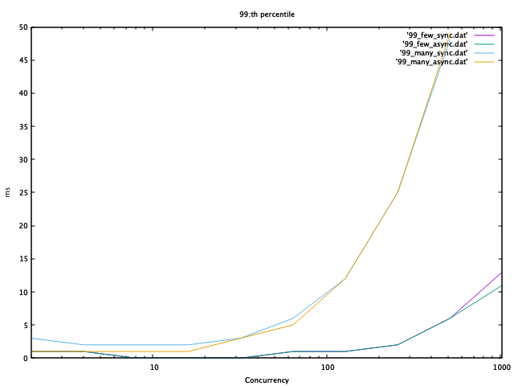
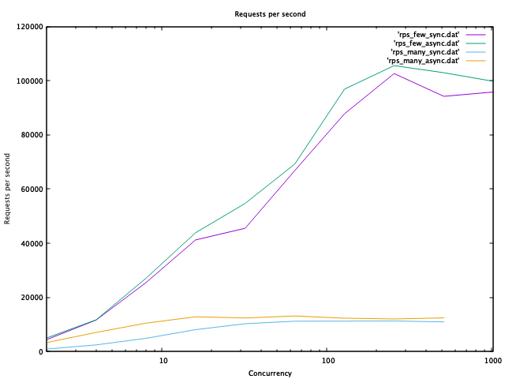

# Sync or Async, that is the question?

Two similar web service endpoints, one async (RxJava) and one sync. What are their performance characteristics?

The web applications performs some meaningless work (serializing back and forth from json to beans), and
then splits the Content up in its parts for storage.

## Content

A piece of content consists of a number of named parts, each of which is a string:string map.

### Database Schema

A top level document with description and a list of parts names are stored per content, each present
part will be stored under contentid+partName.

## Tech Stack

Dropwizard, backed by a Couchbase Server.

```
$ docker run --rm -d --name db -p 8091-8094:8091-8094 -p 11210:11210 couchbase/server:community-5.1.1
```

1. Create a bucket named content.
2. Configure a Couchbase user (content:content) with access to the content bucket.

## Data model

The web service can create and fetch content. A content consists of a bunch of Parts, all stored in their own documents.

## Example usage

```
$ curl -XPUT -H'Content-Type: application/json' localhost:8080/sync/walter -d'{"description":"Hello, World!", "parts":{"foo":{"bar":"baz"}, "qux": {"quux": "quuz"}}}'
```

```
$ curl -s localhost:8080/sync/walter | jq
{
  "id": "walter",
  "description": "Hello, World!",
  "parts": {
    "qux": {
      "quux": "quuz"
    },
    "foo": {
      "bar": "baz"
    }
  }
}
```

### Analysis

ab, service and couchbase on their own c5.9xlarge machines

```
$ tar xf results.tar
$ ./analyze.sh
```

"few" means without loading parts from other documents, "many" means loading parts from their own documents.






CPU load was higher on the sync runs than on the async runs, but throughput was not lower. Probably bottlenecked by something else (network?).
